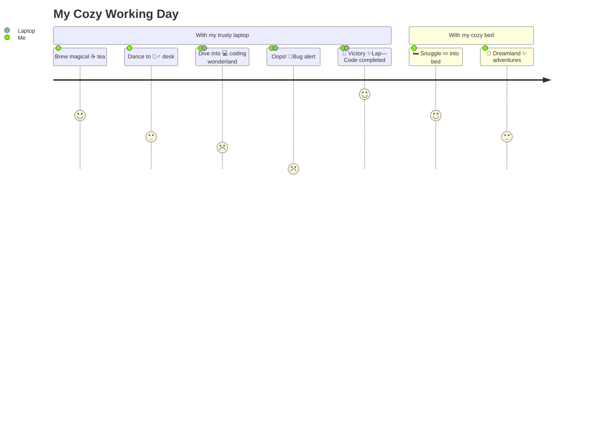

<h1 align="center">
[Rust Engineering in Blockchain & AI]     1.01^365 = 37.78 | 0.99^365 = 0.026
  <h2 align="center">
    
    
  </h2>
</h1>

```mermaid
journey
  title My Cozy Working Day
  section With my trusty laptop
     Brew magical ☕️ tea: 5: Me 
     Dance to 🧙‍♂️ desk: 3: Me 
     Dive into 💻 coding wonderland: 2: Me, Laptop 
     Oops! 🚨Bug alert: 0: Me, Laptop 
    🎉 Victory ✨Lap—Code completed: 7: Me, Laptop 
  section With my cozy bed
    🛏️ Snuggle 💤 into bed: 5: Me 
    🌙 Dreamland ✨ adventures: 3: Me 
```
